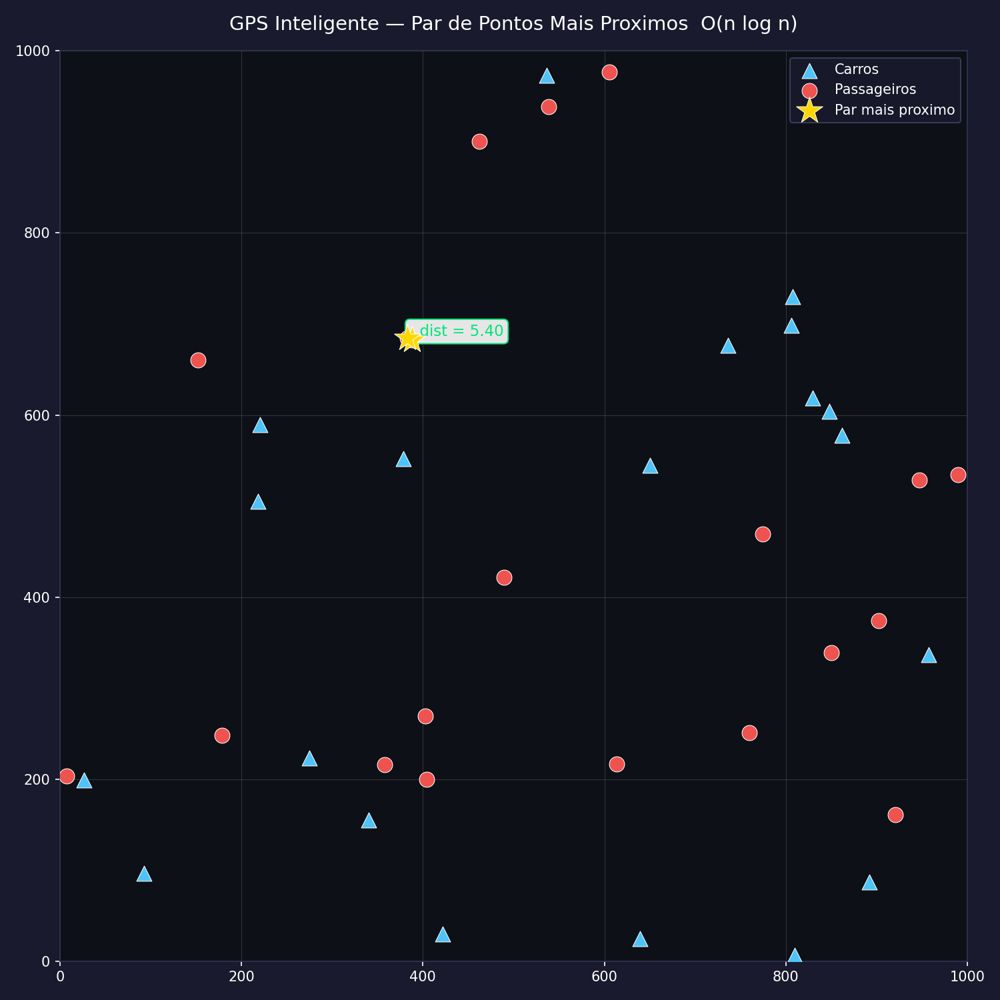
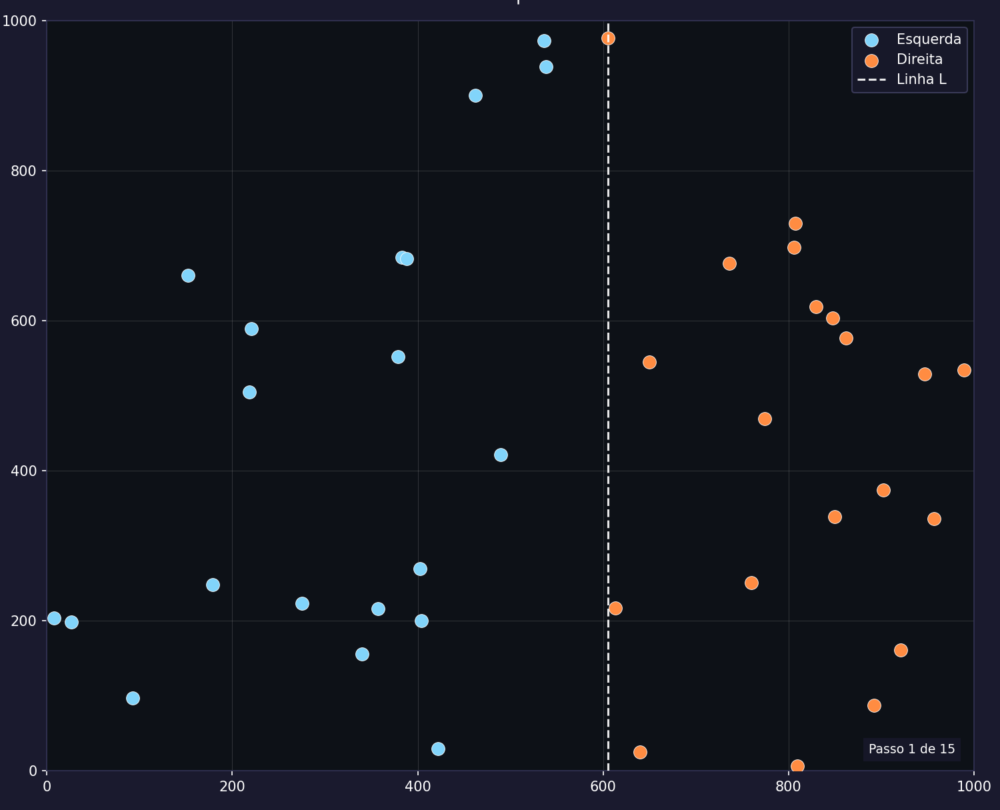
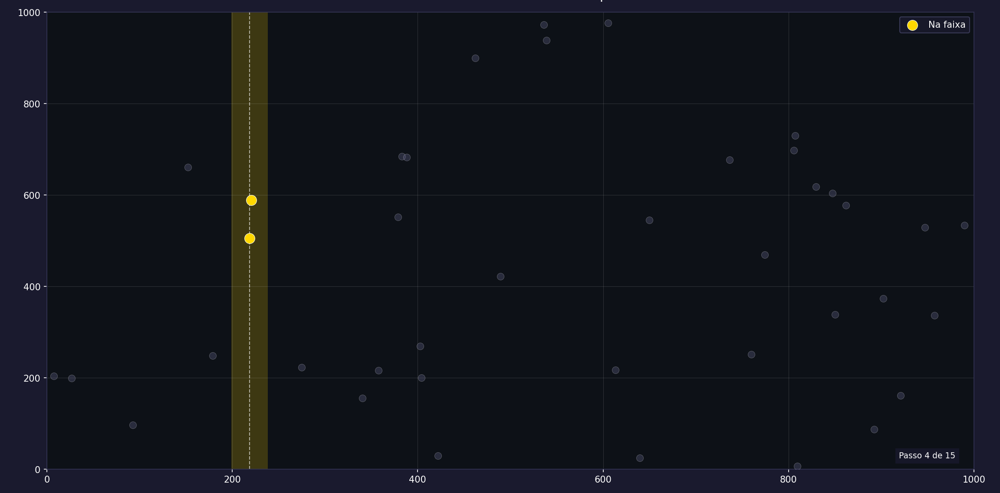
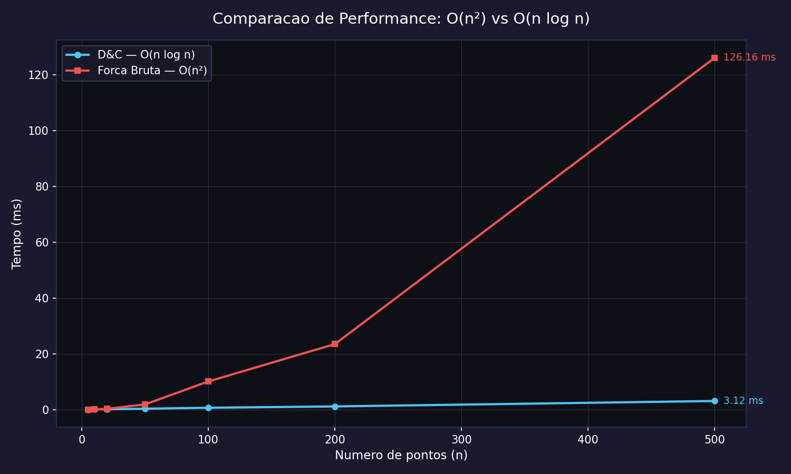

# G18\_Dividir-e-Conquistar\_PA-26.1

**Número da Lista**: 18<br>
**Conteúdo da Disciplina**: Dividir e Conquistar<br>

## Alunos

| Matrícula | Aluno |
| -- | -- |
| 202016382 | Guilherme Meister Correa |
| 202063462 | Samuel Alves Silva |

## Sobre

Este projeto implementa o **Par de Pontos Mais Próximos** aplicado a um cenário de GPS inteligente — encontrar o carro mais próximo de um passageiro em uma cidade simulada.

Pontos (carros e passageiros) são gerados aleatoriamente em um plano 1000 × 1000. Em seguida, dois algoritmos encontram o par de pontos mais próximo entre os dois grupos:

- **Força Bruta — O(n²)** — avalia todos os n·(n−1)/2 pares, usado como baseline de corretude.
- **Dividir e Conquistar — O(n log n)** — divide o plano pela mediana em x, resolve cada metade recursivamente e combina verificando apenas a faixa central de largura 2δ; no máximo 7 vizinhos precisam ser checados por ponto nessa faixa.

O resultado é exibido em três saídas gráficas:

| Saída | Descrição |
|---|---|
| `output_map.png` | Mapa estático com o par mais próximo destacado |
| `output_animation.gif` | Animação passo a passo da recursão (divide → faixa → resultado) |
| `output_comparison.png` | Gráfico de tempo O(n²) vs O(n log n) para tamanhos crescentes |

## Apresentação

> Link do vídeo de apresentação (a ser adicionado)

## Screenshots

| Mapa — Resultado Final |
|---|
|  |

| Animação — Passo de Divisão | Animação — Faixa Central |
|---|---|
|  |  |

| Comparação de Performance |
|---|
|  |

## Instalação

**Linguagem**: Python 3.8+<br>
**Dependências**: `matplotlib`

Clone o repositório e instale as dependências:

```bash
git clone https://github.com/projeto-de-algoritmos-2026/G18_Dividir-e-Conquistar_PA-26.1.git
cd G18_Dividir-e-Conquistar_PA-26.1
pip install matplotlib
```

## Uso

Execute o programa principal na raiz do repositório:

```bash
python main.py
```

O terminal imprime as estatísticas dos dois algoritmos e, em seguida, oferece opções interativas:

```
====================================================
        GPS Inteligente - Dividir e Conquistar
====================================================

                     CENARIO
----------------------------------------------------
  Carros        : 20
  Passageiros   : 20

             FORCA BRUTA  [O(n^2)]
----------------------------------------------------
  Par           : Carro_X  <->  Passageiro_Y
  Distancia     : 12.3456
  Comparacoes   : 780
  Tempo         : 0.1234 ms

        DIVIDIR E CONQUISTAR  [O(n log n)]
----------------------------------------------------
  Par           : Carro_X  <->  Passageiro_Y
  Distancia     : 12.3456
  Comparacoes   : 42
  Tempo         : 0.0312 ms
  Passos        : 9

Ver animacao passo a passo? (s/n):
Ver comparacao de performance? (s/n):
```

1. Responda `s` para ver a animação passo a passo da recursão (também salva `output_animation.gif`).
2. Responda `s` para gerar o gráfico de comparação de performance (também salva `output_comparison.png`).

## Outros

### Como funciona o Dividir e Conquistar

```
closest_pair_dc(P):
    1. Ordena P por coordenada x                     → O(n log n)
    2. Divide ao meio: L = P[:mid], R = P[mid:]
    3. δL = closest_pair_dc(L)                       → T(n/2)
    4. δR = closest_pair_dc(R)                       → T(n/2)
    5. δ  = min(δL, δR)
    6. Filtra faixa |x − x_mid| < δ, ordena por y   → O(n)
    7. Checa até 7 vizinhos por ponto na faixa       → O(n)
    8. Retorna min(δ, δ_strip)
```

Recorrência: **T(n) = 2T(n/2) + O(n)** → **O(n log n)** pelo Teorema Mestre (caso 2).

### Comparativo Força Bruta × Dividir e Conquistar

| | Força Bruta | Dividir e Conquistar |
|---|---|---|
| Complexidade | O(n²) | O(n log n) |
| Pares avaliados | n·(n−1)/2 | O(n log n) |
| Faixa central | — | ≤ 7 vizinhos por ponto |
| Estrutura | Dois loops aninhados | Recursão + strip check |
| Corretude | Garantida (exaustivo) | Garantida (prova geométrica) |
| Uso | Baseline / validação | Solução principal |
